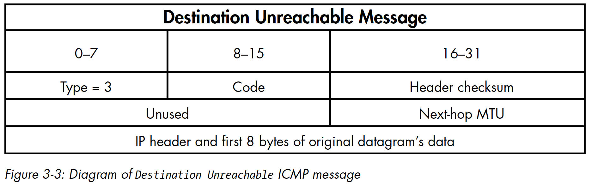

# **Decoding ICMP**



The picture above shows an example of an ICMP packet and its various fields. **ICMP** stands for **Internet Control Message Protocol**, and it is used to send error messages and operational information about network conditions. Here are the details of the fields in an ICMP packet:

- **Type:** The type of ICMP packet, which indicates the purpose of the message. Some common types of ICMP packets include Echo Request (Type 8), Echo Reply (Type 0), Destination Unreachable (Type 3), Time Exceeded (Type 11), and Redirect (Type 5).
- **Code:** A more specific identifier for the ICMP message. The meaning of the code depends on the type of message.
- **Checksum:** A checksum of the ICMP packet to ensure that it has not been corrupted in transit.
- **Identifier:** A unique identifier for the ICMP message, used to match requests and replies.
- **Sequence Number:** A sequence number for the ICMP message, used to match requests and replies.
- **Data:** Optional data that may be included in the message, such as the payload of an Echo Request or Reply.

This information is important for understanding the structure of an ICMP packet and how it is used in communication over a network.

## *`sniffer_with_icmp.py`*

```python
import ipaddress
import os
import socket
import struct
import sys

class IP:
    def __init__(self, buff=None):

        # 'struct' module -> unpack binary data from a buffer -> based on a specified format.
        header = struct.unpack('<BBHHHBBH4s4s', buff) # format string '<BBHHHBBH4s4s' represents the structure of the IP header.

        self.ver = header[0] >> 4
        self.ihl = header[0] & 0xF
        self.tos = header[1]
        self.len = header[2]
        self.id = header[3]
        self.offset = header[4]
        self.ttl = header[5]
        self.protocol_num = header[6]
        self.sum = header[7]
        self.src = header[8]
        self.dst = header[9]

        # human readable IP addresses
        # 'ipaddress' module's function -> create an IPv4Address or IPv6Address object.
        self.src_address = ipaddress.ip_address(self.src) 
        self.dst_address = ipaddress.ip_address(self.dst)

        # map protocol constants to their names
        self.protocol_map = {1: "ICMP", 6: "TCP", 17: "UDP"}
        try:
            self.protocol = self.protocol_map[self.protocol_num]
        except Exception as e:
            print('%s No protocol for %s' % (e, self.protocol_num))
            self.protocol = str(self.protocol_num)

class ICMP:
    def __init__(self, buff):
        header = struct.unpack('<BBHHH', buff)
        self.type = header[0]
        self.code = header[1]
        self.sum = header[2]
        self.id = header[3]
        self.seq = header[4]

def sniff(host):
    # should look familiar from previous example
    if os.name == 'nt':
        socket_protocol = socket.IPPROTO_IP
    else:
        socket_protocol = socket.IPPROTO_ICMP
    sniffer = socket.socket(socket.AF_INET,
                            socket.SOCK_RAW, socket_protocol)
    sniffer.bind((host, 0))
    sniffer.setsockopt(socket.IPPROTO_IP, socket.IP_HDRINCL, 1)
    if os.name == 'nt':
        sniffer.ioctl(socket.SIO_RCVALL, socket.RCVALL_ON)
    try:
        while True:
            raw_buffer = sniffer.recvfrom(65535)[0]
            ip_header = IP(raw_buffer[0:20])
            # if it's ICMP, we want it
            if ip_header.protocol == "ICMP":
                print('Protocol: %s %s -> %s' % (ip_header.protocol,
                ip_header.src_address, 
                ip_header.dst_address))
                print(f'Version: {ip_header.ver}')
                print(f'Header Length: {ip_header.ihl} TTL: {ip_header.ttl}')

                # calculate where our ICMP packet starts
                offset = ip_header.ihl * 4
                buf = raw_buffer[offset:offset + 8]
                # create our ICMP structure
                icmp_header = ICMP(buf)
                print('ICMP -> Type: %s Code: %s\\n' %
                (icmp_header.type, 
                 icmp_header.code))
    except KeyboardInterrupt:
        if os.name == 'nt':
            sniffer.ioctl(socket.SIO_RCVALL, socket.RCVALL_OFF)
        sys.exit()

if __name__ == '__main__':
    if len(sys.argv) == 2:
        host = sys.argv[1]
    else:
        host = '192.168.1.203' # substitude with your machine's IPv4 address
    sniff(host)
```

This code is for sniffing ICMP packets and printing out relevant information, including the protocol, source IP address, destination IP address, version, header length, TTL, and ICMP type and code. The `IP` and `ICMP` classes are defined with the `_fields_` attribute specifying the fields of the IP and ICMP headers, respectively. The `__new__` method of each class creates a new instance of the class from the raw packet data received by the sniffer, and the `__init__` method initializes the instance attributes. The `sniff` function uses the `socket` module to create a raw socket and bind it to the public interface. It then sets the `IP_HDRINCL` option to include the IP header