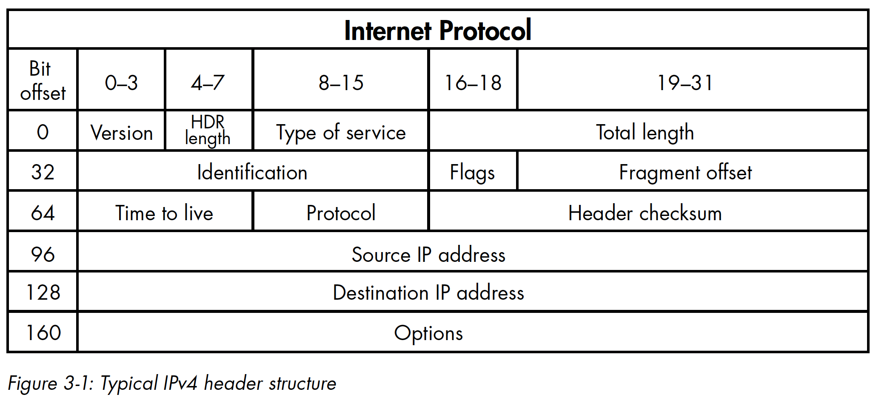

# **Decoding the IP Layer**



The image shows an example of an IP packet and its various fields.

- **Version:** The version of the IP protocol, which is usually 4 or 6.
- **Header Length:** The length of the IP header in 32-bit words. This field is important because it tells the receiver where the actual data starts in the packet.
- **Differentiated Services Code Point (DSCP):** A field that allows packets to be prioritized based on the type of traffic.
- **Explicit Congestion Notification (ECN):** A field that is used to avoid congestion in the network.
- **Total Length:** The total length of the IP packet, including the header and the data.
- **Identification:** A unique identifier for the IP packet.
- **Flags:** A set of three bits that are used to control fragmentation of the packet.
- **Fragment Offset:** The offset of the current fragment relative to the start of the original packet.
- **Time to Live (TTL):** A field that is used to limit the lifetime of the packet in the network.
- **Protocol:** The protocol used in the data portion of the packet.
- **Header Checksum:** A checksum of the IP header to ensure that the packet has not been corrupted in transit.
- **Source IP Address:** The IP address of the sender.
- **Destination IP Address:** The IP address of the receiver.

This information is important for understanding the structure of an IP packet and how it is used in communication over a network.

## **The `ctypes` Module**

The following code snippet defines a new class, IP, that can read a packet
and parse the header into its separate fields:

```python
from ctypes import *
import socket
import struct

class IP(Structure):
    _fields_ = [
        ("ihl", c_ubyte, 4), # 4 bit unsigned char
        ("version", c_ubyte, 4), # 4 bit unsigned char
        ("tos", c_ubyte, 8), # 1 byte char
        ("len", c_ushort, 16), # 2 byte unsigned short
        ("id", c_ushort, 16), # 2 byte unsigned short
        ("offset", c_ushort, 16), # 2 byte unsigned short
        ("ttl", c_ubyte, 8), # 1 byte char
        ("protocol_num", c_ubyte, 8), # 1 byte char
        ("sum", c_ushort, 16), # 2 byte unsigned short
        ("src", c_uint32, 32), # 4 byte unsigned int
        ("dst", c_uint32, 32) # 4 byte unsigned int
    ]

    def __new__(cls, socket_buffer=None):
        return cls.from_buffer_copy(socket_buffer)

    def __init__(self, socket_buffer=None):
        # human readable IP addresses
        self.src_address = socket.inet_ntoa(struct.pack("<L",self.src))
        self.dst_address = socket.inet_ntoa(struct.pack("<L",self.dst))
```

This code defines a `ctypes` Structure called `IP` that represents the various fields of an IP packet header. The `IP` structure is used to parse the packet data received by the sniffer in Chapter 3 of the document. The `_fields_` attribute defines the fields of the `IP` structure and their data types. The `__new__` method creates a new instance of the `IP` structure from the raw packet data received by the sniffer. The `__init__` method converts the `src` and `dst` fields of the `IP` structure from binary format to human-readable IP addresses using the `inet_ntoa` function from the `socket` module and the `pack` function from the `struct` module.

## **The struct Module**

The struct module provides format characters that you can use to specify the structure of the binary data. In the following example, we’ll once again define an IP class to hold the header information. This time, though, we’ll use format characters to represent the parts of the header:

```python
import ipaddress
import struct

class IP:
    def __init__(self, buff=None):
        header = struct.unpack('<BBHHHBBH4s4s', buff)
        self.ver = header[0] >> 4
        self.ihl = header[0] & 0xF
        self.tos = header[1]
        self.len = header[2]
        self.id = header[3]
        self.offset = header[4]
        self.ttl = header[5]
        self.protocol_num = header[6]
        self.sum = header[7]
        self.src = header[8]
        self.dst = header[9]
        # human readable IP addresses
        self.src_address = ipaddress.ip_address(self.src)
        self.dst_address = ipaddress.ip_address(self.dst)
        # map protocol constants to their names
        self.protocol_map = {1: "ICMP", 6: "TCP", 17: "UDP"}
```

The code above defines a class called `IP` that represents the various fields of an IP packet header. The `IP` class is used to parse the packet data received by the sniffer in Chapter 3 of the document. The `__init__` method takes in a byte buffer `buff` and uses the `struct.unpack` function to extract the various fields of the IP header. The IP addresses are then converted from binary format to human-readable IP addresses using the `ipaddress.ip_address` method. The `protocol_map` dictionary is used to map the protocol constants to their names.

In the `struct.unpack()` function in the `IP` class definition, `BBHHHBBH4s4s` is the format string that describes the structure of the IP header. Each character in the format string corresponds to a field in the header, and the number of characters indicates the size of each field in bytes. Here is what each character represents:

- `B`: unsigned char (1 byte)
- `H`: unsigned short (2 bytes)
- `4s`: 4-byte string
- `s`: string (1 byte)

So, `BBHHHBBH4s4s` corresponds to the following fields in the IP header:

- One byte for the version and header length fields `B`
- One byte for the type of service (TOS) field `B`
- Two bytes for the total length field `H`
- Two bytes for the identification field `H`
- Two bytes for the flags and fragment offset fields `H`
- One byte for the time to live (TTL) field `B`
- One byte for the protocol field `B`
- Two bytes for the header checksum field `H`
- Four bytes for the source IP address field `4s`
- Four bytes for the destination IP address field `4s`


The fields are read in the order that they appear in the format string, and their values are returned in a tuple. The `unpack()` function takes the byte buffer as its argument and returns the tuple of field values.

The `IP` class can be used to parse the IP header of a packet as follows:

```python
ip_header = IP(packet[0:20])
print(f"Protocol: {ip_header.protocol_map[ip_header.protocol_num]}")
print(f"Source: {ip_header.src_address}")
print(f"Destination: {ip_header.dst_address}")
```

This code creates an instance of the `IP` class with the first 20 bytes of the packet, which contain the IP header. It then prints out the protocol, source IP address, and destination IP address of the packet.

# **Writing the IP Decoder**

Let’s implement the IP decoding routine. 

## *`sniffer_ip_header_decode.py`*

```python
import ipaddress
import os
import socket
import struct
import sys

class IP:
    def __init__(self, buff=None):

        # 'struct' module -> unpack binary data from a buffer -> based on a specified format.
        header = struct.unpack('<BBHHHBBH4s4s', buff) # format string '<BBHHHBBH4s4s' represents the structure of the IP header.

        self.ver = header[0] >> 4
        self.ihl = header[0] & 0xF
        self.tos = header[1]
        self.len = header[2]
        self.id = header[3]
        self.offset = header[4]
        self.ttl = header[5]
        self.protocol_num = header[6]
        self.sum = header[7]
        self.src = header[8]
        self.dst = header[9]

        # human readable IP addresses
        # 'ipaddress' module's function -> create an IPv4Address or IPv6Address object.
        self.src_address = ipaddress.ip_address(self.src) 
        self.dst_address = ipaddress.ip_address(self.dst)

        # map protocol constants to their names
        self.protocol_map = {1: "ICMP", 6: "TCP", 17: "UDP"}
        try:
            self.protocol = self.protocol_map[self.protocol_num]
        except Exception as e:
            print('%s No protocol for %s' % (e, self.protocol_num))
            self.protocol = str(self.protocol_num)

''''
    Previously explained & used on sniffer.py
'''
def sniff(host):
    # should look familiar from previous example
    if os.name == 'nt':
        socket_protocol = socket.IPPROTO_IP
    else:
        socket_protocol = socket.IPPROTO_ICMP
    sniffer = socket.socket(socket.AF_INET,
                            socket.SOCK_RAW, socket_protocol)
    sniffer.bind((host, 0))
    sniffer.setsockopt(socket.IPPROTO_IP, socket.IP_HDRINCL, 1)
    if os.name == 'nt':
        sniffer.ioctl(socket.SIO_RCVALL, socket.RCVALL_ON)
    try:
        while True:
            # read a packet
            raw_buffer = sniffer.recvfrom(65535)[0]
            # create an IP header from the first 20 bytes
            ip_header = IP(raw_buffer[0:20])
            # print the detected protocol and hosts
            print('Protocol: %s %s -> %s' % (ip_header.protocol,
            ip_header.src_address,
            ip_header.dst_address))
    except KeyboardInterrupt:
        # if we're on Windows, turn off promiscuous mode
        if os.name == 'nt':
            sniffer.ioctl(socket.SIO_RCVALL, socket.RCVALL_OFF)
        sys.exit()

if __name__ == '__main__':
    if len(sys.argv) == 2:
        host = sys.argv[1]
    else:
        host = '192.168.1.203' # substitude with your machine's IPv4 address
    sniff(host)
```

The code above is a Python script that demonstrates how to sniff and print out the contents of a single IP packet on a network interface. The script uses the `socket` module to create a raw socket and bind it to the public interface. It then sets the `IP_HDRINCL` option to include the IP header in the packet capture, reads one packet using `sniffer.recvfrom(65535)[0]`, and prints out the protocol, source IP address, and destination IP address of the packet. If the OS is Windows, the script enables promiscuous mode using `sniffer.ioctl()` and `RCVALL_ON` before reading the packet, and disables it using `sniffer.ioctl()` and `RCVALL_OFF` after reading the packet.

### ***Kicking the Tires***

- Find your machine's IPv4 address in Windows using:
    
    ```powershell
    ipconfig 
    ```
    
    Substitute this ip with Host address. 
    

You can run the script in the command line by typing `python sniffer_ip_header_decode.py <host>`, where `<host>` is the IP address of the host you want to listen on. If no host is specified, the script will listen on the default host `192.168.1.203`.